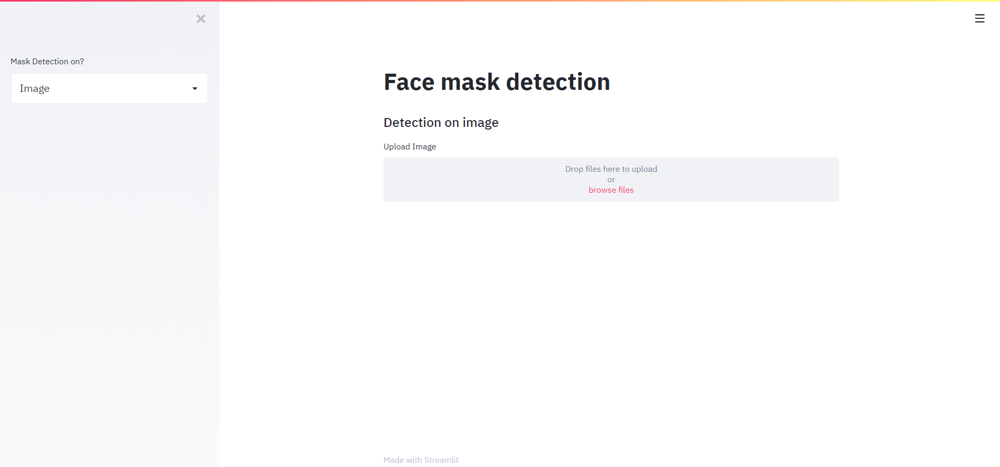
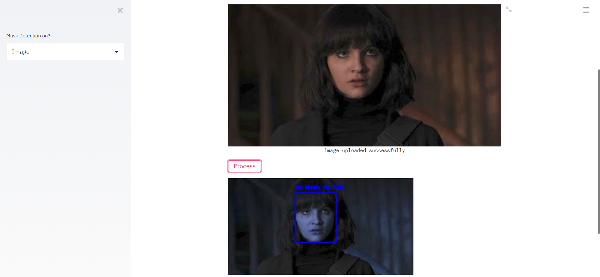

<h1 align="center">Face Mask Detection</h1>

  <h4>Face Mask Detection system built with OpenCV, Keras/TensorFlow using Deep Learning and Computer Vision concepts in order to detect face masks in static images as well as in real-time video streams.</h4>

&nbsp;&nbsp;&nbsp;&nbsp;&nbsp;&nbsp;&nbsp;&nbsp;&nbsp;&nbsp;&nbsp;&nbsp;&nbsp;&nbsp;&nbsp;&nbsp;&nbsp;&nbsp;&nbsp;&nbsp;&nbsp;&nbsp;&nbsp;&nbsp;&nbsp;&nbsp;&nbsp;&nbsp;&nbsp;&nbsp;

&nbsp;&nbsp;&nbsp;&nbsp;&nbsp;&nbsp;&nbsp;&nbsp;&nbsp;&nbsp;&nbsp;&nbsp;&nbsp;&nbsp;&nbsp;&nbsp;&nbsp;&nbsp;&nbsp;&nbsp;&nbsp;&nbsp;&nbsp;&nbsp;&nbsp;&nbsp;&nbsp;&nbsp;&nbsp;&nbsp;&nbsp;&nbsp;&nbsp;&nbsp;&nbsp;

## :innocent: Motivation
In the present scenario due to Covid-19, there is no efficient face mask detection applications which are now in high demand for transportation means, densely populated areas, residential districts, large-scale manufacturers and other enterprises to ensure safety. Also, the absence of large datasets of __‘with_mask’__ images has made this task more cumbersome and challenging. 

 

## :file_folder: Dataset
The dataset used can be downloaded here - [Click to Download](https://drive.google.com/drive/folders/1XDte2DL2Mf_hw4NsmGst7QtYoU7sMBVG?usp=sharing)

This dataset consists of __3835 images__ belonging to two classes:
*	__with_mask: 1916 images__
*	__without_mask: 1919 images__

The images used were real images of faces wearing masks. 
## :key: Prerequisites

All the dependencies and required libraries are included in the file <code>requirements.txt</code> [See here](https://github.com/chandrikadeb7/Face-Mask-Detection/blob/master/requirements.txt)

## :key: Results

#### This model gave 93% accuracy for Face Mask Detection after training via <code>tensorflow-gpu==2.0.0</code>

#### We got the following accuracy/loss training curve plot

## Images

  

Upload Images

  

Results

